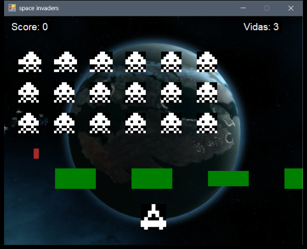

# Space Invaders (C# / WinForms)

A small Space Invaders clone written in C# with Windows Forms (.NET Framework 4.7.2).
Final project for an object-oriented programming course.



## Gameplay

- Move the ship with **← / →** and shoot with **Space** (200 ms cooldown between shots).
- 18 enemies (3 rows × 6 columns) march sideways and drop one step each time they hit
  the edge of the screen; a random enemy fires every second.
- 4 green barriers absorb shots from both sides and shrink with each hit until they disappear.
- Each enemy destroyed is worth 10 points. You start with 3 lives.
- You win when every enemy is destroyed; you lose when you run out of lives or an enemy
  reaches the bottom of the screen.

## Build and run

Requirements: Windows, and Visual Studio 2019 or later with the *.NET desktop development*
workload (it includes the .NET Framework 4.7.2 targeting pack).

**Visual Studio:** open `SpaceInvaders.sln` and press **F5**.

**Command line** (Developer PowerShell for Visual Studio):

```powershell
msbuild SpaceInvaders.sln /p:Configuration=Release
cd bin\Release
.\SpaceInvaders.exe
```

> The game loads its images from the relative folder `Recursos\`, which the build copies next
> to the executable. Run `SpaceInvaders.exe` from its own folder (as above); launching it from
> another working directory makes the image loading fail.

## Project structure

```
Program.cs              entry point
Form1.cs                game loop (10 ms timer), input, collisions, score and lives
Clases/Jugador.cs       player ship
Clases/Enemigo.cs       enemy
Clases/Disparo.cs       projectile (player shots go up, enemy shots go down)
Clases/Barrera.cs       destructible barrier
Recursos/               sprites and background
```

Every game object wraps a `PictureBox` sprite; collisions use `Rectangle.IntersectsWith`.

There are no automated tests in this project.

## License

[MIT](LICENSE) © 2026 Hector Hugo Naranjo

---

## Resumen en español

Clon de Space Invaders en C# con Windows Forms (.NET Framework 4.7.2), proyecto final de
programación orientada a objetos. Te mueves con las flechas y disparas con la barra
espaciadora; hay 18 enemigos, 4 barreras destructibles, puntaje y 3 vidas. Para ejecutarlo,
abre `SpaceInvaders.sln` en Visual Studio y presiona F5, o compila con
`msbuild SpaceInvaders.sln /p:Configuration=Release` y ejecuta `SpaceInvaders.exe` desde
`bin\Release` (las imágenes se cargan desde la carpeta `Recursos` junto al ejecutable).
